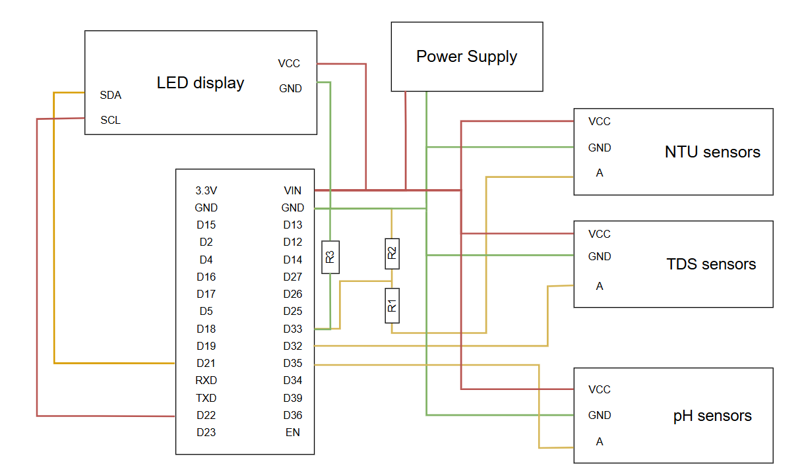

# Smart Water Monitoring System

A Django-based IoT water quality monitoring system with ESP32 sensors and real-time dashboard.

## Overview

This project builds a **floating buoy system** for **automatic water quality monitoring**.
It collects real-time data such as pH, turbidity (NTU), temperature, conductivity, dissolved oxygen… using IoT sensors and transmits them to a central server over LoRa, 4G or Wi-Fi.
AI models analyse trends, detect anomalies and predict near-future water quality to provide early warnings.
The platform offers interactive dashboards, visual reports and alerts to support efficient water environment management.

## Features

### Real-time Monitoring
- ESP32 integration for pH, TDS, NTU sensors (expandable: temperature DS18B20, GPS, dissolved oxygen)
- Live dashboard with Chart.js visualization
- Real-time water quality alerts
- Historical data tracking

### API & Authentication
- Django REST Framework with JWT authentication
- Swagger/OpenAPI documentation
- Rate limiting and security headers
- CORS support for frontend integration

### Database Support
- PostgreSQL for production
- MySQL for development
- Flexible database configuration via environment variables

### Code Quality
- Automated testing with pytest
- Code formatting with black, flake8, isort
- GitHub Actions CI/CD pipeline
- Docker containerization support

## Hardware Components

- ESP32 DevKit
- pH sensor (analog/BNC) for acidity measurement
- NTU sensor for turbidity
- TDS sensor for total dissolved solids
- DS18B20 sensor for water temperature
- GPS module (NEO-6M or similar)
- LED display for local feedback
- Power supply unit

### Hardware Diagram



## Project Structure

```
water_monitoring/
├── monitoring/             # Main Django app
├── templates/              # HTML templates
├── water_monitor/          # Django settings
├── firmware/               # ESP32 Arduino code
├── sensor_analysis/        # Data analysis scripts
├── static/                 # Static files
├── scripts/                # Utility scripts
└── docs/
    └── hardware-diagram.png
```

## Quick Start

### Environment Setup
```bash
# Clone repository
git clone https://github.com/phunolg/Smart-Water-Monitoring-System.git
cd Smart-Water-Monitoring-System

# Create virtual environment
python -m venv .venv
.venv\Scripts\activate  # Windows
source .venv/bin/activate  # Linux/Mac

# Install dependencies
pip install -r requirements.txt

# Setup pre-commit hooks (recommended)
./setup-precommit.sh        # Linux/Mac
# OR
./setup-precommit.ps1       # Windows PowerShell
```

### Database Configuration
```bash
# Copy environment file
cp .env.example .env
# Edit .env with your database credentials

# Run migrations
python manage.py migrate
python manage.py createsuperuser
```

### Run Server
```bash
python manage.py runserver 0.0.0.0:8000
```

### Access Points
- Dashboard: http://localhost:8000/dashboard/
- API Documentation: http://localhost:8000/api/docs/
- Admin Panel: http://localhost:8000/admin/
- Health Check: http://localhost:8000/health/
```

## ESP32 Setup

### Hardware Requirements
- ESP32 DevKit
- pH sensor for water acidity measurement
- TDS sensor for total dissolved solids
- NTU sensor for water turbidity

### Firmware Installation
1. Open `firmware/water_sensor.ino` in Arduino IDE
2. Configure WiFi and server settings
3. Upload to ESP32
4. Monitor serial output for connection status

### Configuration
```cpp
// Edit in water_sensor.ino
const char* ssid = "YOUR_WIFI_SSID";
const char* password = "YOUR_WIFI_PASSWORD";
const char* serverURL = "http://192.168.1.9:8000/api/upload-reading/";
```

## API Endpoints

### Authentication
```http
POST /api/auth/login/          # JWT login
POST /api/auth/refresh/        # Token refresh
```

### Sensor Data
```http
GET  /api/readings/            # List readings
POST /api/upload-reading/      # ESP32 data upload
GET  /api/readings/{id}/       # Get specific reading
GET  /health/                  # Health check
```

## Development

### Pre-commit Hooks (Recommended)
```bash
# Setup pre-commit hooks - automatically format & lint before commit
./setup-precommit.sh           # Linux/Mac
./setup-precommit.ps1          # Windows PowerShell
```

### Testing
```bash
python manage.py test          # Run Django tests
pytest                         # Run pytest tests
pytest --cov=monitoring        # With coverage
```

### Code Quality
```bash
black monitoring/              # Format code
isort monitoring/              # Sort imports
flake8 monitoring/             # Lint code
```

## Technology Stack

### Backend
- Django 5.2.6
- Django REST Framework
- PostgreSQL/MySQL
- JWT Authentication

### Frontend
- Chart.js for data visualization
- Bootstrap for UI
- JavaScript for interactivity

### IoT
- ESP32 microcontroller
- Arduino IDE for firmware
- HTTP API for data transmission

## Dashboard Features

### Real-time Charts
- **pH Levels**: Acidity monitoring with safe ranges
- **TDS Values**: Dissolved solids tracking
- **NTU Readings**: Turbidity measurements
- **Auto-refresh**: 10-second update intervals

### Data Tables
- **Recent Readings**: Last 50 sensor measurements
- **Device Status**: ESP32 connection monitoring
- **Alert System**: Quality threshold notifications

## Security Features

- **JWT Authentication**: Secure API access
- **CORS Configuration**: Cross-origin request control
- **Rate Limiting**: API abuse protection
- **Input Validation**: SQL injection prevention
- **Security Headers**: XSS and clickjacking protection

## Monitoring & Health

### Health Check Endpoint
```json
GET /health/
{
  "status": "healthy",
  "timestamp": "2025-09-28T20:03:24Z",
  "database": "connected",
  "version": "1.0.0"
}
```

### System Metrics
- Database connection status
- API response times
- ESP32 connectivity
- Memory usage monitoring

## Production Deployment

### Environment Variables
```env
DEBUG=False
SECRET_KEY=your-secret-key
DB_NAME=production_db
DB_USER=db_user
DB_PASSWORD=secure_password
ALLOWED_HOSTS=yourdomain.com
```

## Roadmap

- [ ] **Mobile App**: React Native companion app
- [ ] **Grafana**: Advanced monitoring dashboard
- [ ] **InfluxDB**: Time-series database integration
